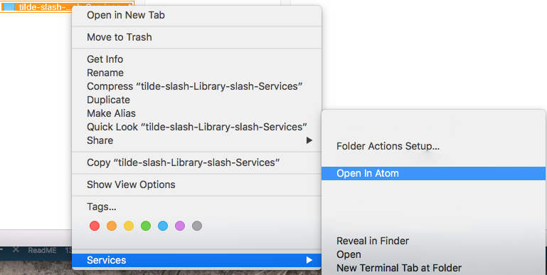

# README #

## Installing in Finder

### Drag and Drop
1. Hold the option Key
1. Click the Go Menu
1. Choose Library to open your Library
1. Scroll down to 'Services' Directory
1. Drag and drop the "Open in Atom.workflow" into Services

or

### Use a shell command
```bash
mv -iv "Open in Atom.workflow" ~/Library/Services/
```

## In Action in Finder
1. Go to a File or a Folder
1. Right Click (or Ctrl-Click) for File Commands menu
1. Cursor over Service
1. Choose "Open in Atom"

### Example Screenshot


